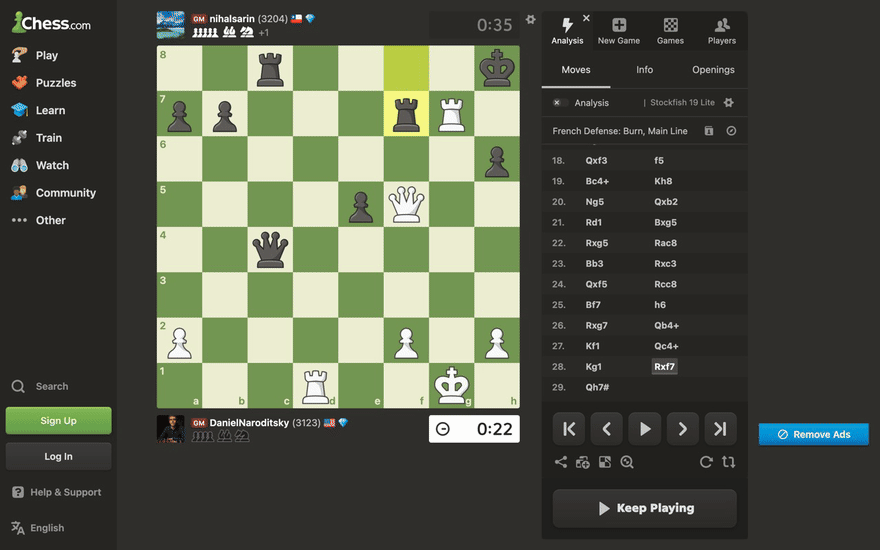

# ♟️ Stockfish Continue to Play

**Browser extension for Chess.com - when a game ends, keep playing the final position vs Stockfish on the same board. One click.**

[](#installation)
[](#firefox)
[](LICENSE)



<sub>A real game ends, "Continue vs Computer" appears, and the same board keeps going against Stockfish - no redirect, no new tab. Recorded at 2x.</sub>

---

## The problem

You're winning. Your opponent resigns, disconnects, or times out. Game over - but you
wanted to play it through. This extension adds a **Continue vs Computer** button to the
game-over screen. Click it and you keep playing the exact final position against
Stockfish, right there on the Chess.com board, with difficulty matched to your
opponent's rating.

```
Chess.com: Game Over  →  [♟ Continue vs Computer]  →  play the position vs Stockfish (inline)
```

---

## Why I built this

In fast games - bullet, blitz - opponents resign or disconnect all the time, often
in positions where the most interesting part is still ahead. I wanted to keep playing
from exactly where we left off, on the same board, without setting anything up.

Earlier versions redirected to Lichess to do this. Since v3.0.0 the engine runs
in-page, so the game never leaves Chess.com.

---

## Features

- **Inline on the real board** - no redirect, no new tab; you keep playing on the Chess.com board you were already on.
- **Adaptive difficulty** - Stockfish's `UCI_Elo` is matched to the opponent's rating read from the page.
- **No servers, no telemetry** - Stockfish runs entirely in your browser, as WebAssembly. Nothing is uploaded; it works offline, and that is verified by the test suite, not just claimed.
- **Click or drag** - move pieces either way; legal destinations are highlighted; promotions auto-queen.
- **Correct chess** - castling, en-passant, checkmate/stalemate and repetition are handled by the engine itself (moves are replayed to Stockfish).
- **On/off toggle** - a popup to disable it when you don't want it.
- **Open source** - GPLv3, because it bundles Stockfish.

---

## Installation

The extension is **not yet published** on the Chrome Web Store or Firefox Add-ons, so it is
installed by hand. The quickest way is the prebuilt zip.

### Chrome, Edge, Brave, Arc, Opera

1. Download `stockfish-continue-to-play-chrome-<version>.zip` from the newest `v…` release
   on the [Releases page](https://github.com/thousandflowers/stockfish-continue-to-play/releases).
2. Unzip it.
3. Open `chrome://extensions`, turn on **Developer mode**, click **Load unpacked** and pick
   the unzipped folder.

That is all. **The release zips already bundle the Stockfish engine**, so there is no
download script to run and nothing is fetched at runtime.

### Firefox

Firefox needs its own zip - `stockfish-continue-to-play-firefox-<version>.zip` from the same
release. Unzip it, then open `about:debugging#/runtime/this-firefox`, click **Load Temporary
Add-on** and pick the `manifest.json` inside the unzipped folder.

> **Temporary is literal.** Until the add-on is signed by addons.mozilla.org, Firefox will
> only load it as a temporary add-on: it is removed when you close the browser, and you have
> to load it again every session. Chrome has no such restriction.

### From source

```bash
# 1. Clone
git clone https://github.com/thousandflowers/stockfish-continue-to-play.git
cd stockfish-continue-to-play

# 2. Download the Stockfish engine (~7 MB, kept out of git, checksum-verified)
bash scripts/download-stockfish.sh

# 3a. Chrome / Edge / Brave / Arc / Opera
#     chrome://extensions → enable "Developer mode" → "Load unpacked" → pick this folder

# 3b. Firefox 128+ uses a separate manifest - swap it in first
#     cp manifest-firefox.json manifest.json
#     about:debugging#/runtime/this-firefox → "Load Temporary Add-on" → pick manifest.json
```

> The engine - `stockfish.js` (21 KB loader) and `stockfish.wasm` (7 MB) - is excluded
> from git to keep clones lean. The [download script](scripts/download-stockfish.sh)
> fetches both and verifies them against the checksums pinned in `stockfish.sha256`.

---

## How to use

1. Finish (or lose/win) a game on Chess.com.
2. On the game-over screen, click **♟ Continue vs Computer**.
3. Play. The badge in the top-right shows whose turn it is; click it to stop.

---

## Roadmap

| | Status |
|---|:---:|
| Chess.com inline play vs Stockfish | ✅ |
| Adaptive difficulty from opponent rating | ✅ |
| Chrome Web Store release | ◻︎ planned |
| Firefox Add-ons release | ◻︎ planned |

---

## Contributing

See [CONTRIBUTING.md](CONTRIBUTING.md) for local dev setup, testing, and PR guidelines.

## Architecture

See [ARCHITECTURE.md](ARCHITECTURE.md) for the FEN extraction, the move-history engine
model, difficulty mapping, and project structure.

---

## License

No data leaves your machine - see [PRIVACY.md](PRIVACY.md).

**GPLv3** - see [LICENSE](LICENSE).

This extension bundles [Stockfish](https://github.com/official-stockfish/Stockfish), which
is licensed under the GNU General Public License v3. Distributing Stockfish inside the
package makes the whole package a combined work, so this project is GPLv3 too: you may use,
study, modify and redistribute it under those terms, and anyone you pass it to gets the same
rights and the right to the corresponding source.

Credit where it is due: Stockfish is the work of **the Stockfish developers** (T. Romstad,
M. Costalba, J. Kiiski, G. Linscott and many other contributors - see the project's AUTHORS
file), the JavaScript port is [nmrugg/stockfish.js](https://github.com/nmrugg/stockfish.js),
and the neural network is by Linmiao Xu. Their notices are reproduced verbatim in
[LICENSE.stockfish](LICENSE.stockfish).

Exactly which build is bundled, its checksum, and what is and is not known about where it
came from: [vendor/STOCKFISH-PROVENANCE.md](vendor/STOCKFISH-PROVENANCE.md).

Up to and including v3.0.0 this project was released under the MIT licence, and code
contributed in that period was contributed under it. MIT asks that its copyright notice be
preserved, so it is: see [LICENSE.MIT](LICENSE.MIT). That code is redistributed here under
the GPLv3, which MIT permits.
